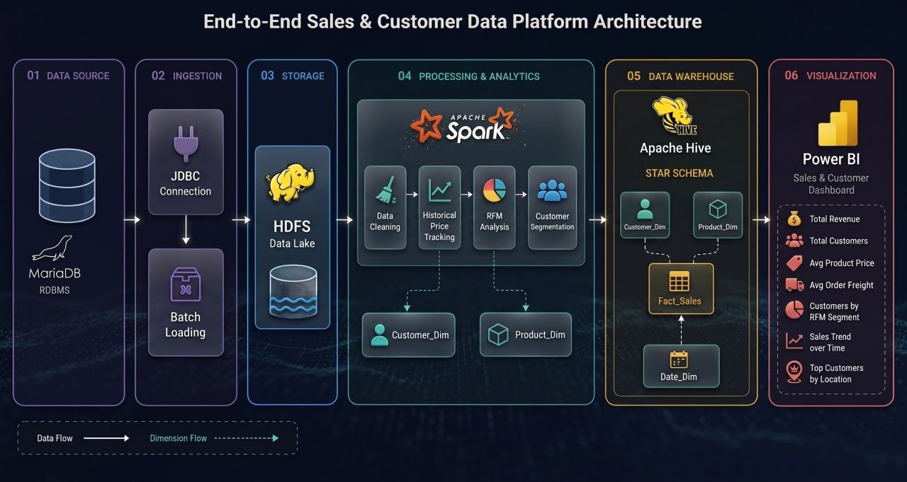
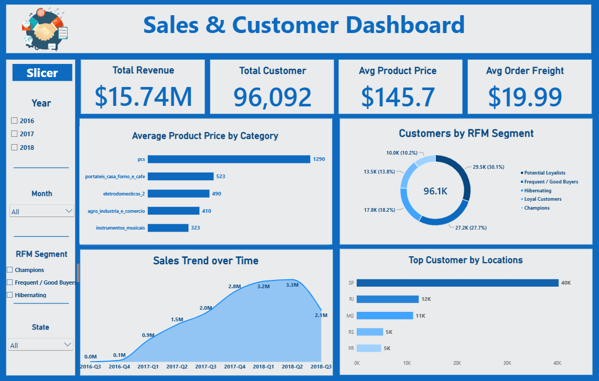

# SIC-Ecomm-Dimensional-Modeling

This repository contains project_1 for the Samsung Innovation Campus (Round 8) Big Data Track. Our team implemented **Customers and Products Dimensional Modeling** using the Brazilian E-Commerce Public Dataset by Olist. We built an end-to-end Big Data pipeline spanning raw data ingestion, distributed ETL processing, dimensional modeling, and machine learning.



## Repository Structure
```text
SIC-Ecomm-Dimensional-Modeling/
├── .gitignore
├── Docs/
│   ├── Dashboard_doc.pdf
|   ├── E-Commerce _Customer_&_Product_Modeling.pdf
|   └── Presentation.pptx
├── Hive/
│   ├── Hive DDL
│   ├── Image .jpeg
│   └── analytical_queries
├── Images/
│   ├── Dashboard.png
│   └── Project_flow.jpg
├── ML/
│   └── RandomForestML.ipynb
├── MySQL/
│   ├── 01_create_source_tables.sql
│   └── 02_bulk_insert.sql
├── Spark/
│   ├── Cleaning&Dim_Product.ipynb
│   ├── Customer_Dim_RFM.ipynb
│   ├── Dim_Date.ipynb
│   ├── Fact_Sales.ipynb
│   └── Ingestion.ipynb
└── README.md
```

---

## Architecture & Workflow

### Step 1: Source System Simulation & Raw Data Loading

To accurately simulate a real-world operational environment before applying ETL transformations, we set up a local MariaDB instance to act as our transactional source system.
* **The Dataset:** We utilized the Olist Brazilian E-Commerce Dataset, targeting five core operational CSV files (Customers, Products, Orders, Items, Payments).
* **Database Initialization:** We created the `olist_raw` database to mirror the raw files using `MySQL/01_create_source_tables.sql`.
* **Bulk Ingestion:** We bypassed standard `INSERT` statements, using MySQL's `LOAD DATA LOCAL INFILE` command via `MySQL/02_bulk_insert.sql` to efficiently ingest hundreds of thousands of records.

### Step 2: PySpark ETL & Dimensional Modeling
We utilized Apache Spark (`pyspark.sql`) to extract the data from MariaDB, clean it, and build our star schema architecture on HDFS.
* **`Ingestion.ipynb`:** Establishes a JDBC connection to MariaDB and lands the raw operational data into the HDFS `/raw_zone`.
* **`Cleaning&Dim_Product.ipynb`:** Cleans product data and implements Slowly Changing Dimensions (SCD Type 2) to track historical product pricing changes over time.
* **`Customer_Dim_RFM.ipynb`:** Aggregates customer spending behaviors to calculate Recency, Frequency, and Monetary (RFM) scores, segmenting buyers into categories like "Champions" and "At Risk".
* **`Dim_Date.ipynb` & `Fact_Sales.ipynb`:** Generates a continuous date dimension and builds the central partitioned fact table, tying customers, products, and financial transactions together for analysis.

### Step 3: Machine Learning (Late Delivery Prediction)
**Notebook:** `ML/RandomForestML.ipynb`

To extract actionable business value, we engineered a machine learning pipeline using PySpark MLlib. 
* We transformed categorical variables and vectorized features like freight cost, product weight, and customer location.
* **Key Finding:** The model revealed that geographical location (`customer_state`) and physical logistics (`total_weight`/`freight`) were the primary drivers of late deliveries, rather than internal payment approval delays.

### Step 4: Data Warehouse & Analytics
We deployed our final star schema into Apache Hive for querying and visualization.
* **`Hive DDL`:** Defines the External Tables pointing to our PySpark Parquet outputs, fully resolving PySpark/Hive `DECIMAL` to `DOUBLE` encoding formats and partitioning the `fact_sales` table by year and month.
* **`analytical_queries`:** A suite of SQL queries answering critical business questions (e.g., Quarterly Sales Trends, Busiest Purchase Hours, and Top Categories).

---

### Step 5: Sales & Customer Dashboard
To bring our data warehouse to life, we connected Power BI to our architecture to visualize key business metrics, pricing analysis, customer RFM segmentation, revenue trends, and geographic distributions.



#### Key Performance Indicators (KPIs)
* **Total Revenue:** $15.74M (Cumulative payment value across all orders).
* **Total Customers:** 96,092 (Total count of distinct buyers).
* **Avg Product Price:** $145.7.
* **Avg Order Freight:** $19.99.

#### Core Visual Insights
* **Average Product Price by Category:** Highlights the most expensive categories on average, led by `pcs` ($1290) and `portateis_casa_forno_e_cafe` ($523).
* **Customers by RFM Segment:** The customer base is heavily driven by **Potential Loyalists (30.1% | 29.5K)** and **Champions (27.7% | 27.2K)**.
* **Sales Trend over Time:** Showcases our quarterly revenue growth trajectory, peaking at $3.3M in 2018-Q2. 
  * *Data Note:* The drop observed in 2018-Q3 ($2.1M) is due to data truncation (records end mid-quarter in August 2018), not a decline in actual business performance.
* **Top Customer by Locations:** Geographically, **São Paulo (SP)** overwhelmingly dominates the customer base with over 40K buyers, followed by Rio de Janeiro (RJ) at 12K.

#### Interactive Slicers
The dashboard enables deep-dive filtering across several dimensions:
* **Year & Month:** To isolate specific temporal trends.
* **RFM Segment:** To analyze the behavior of specific customer groups (e.g., filtering only for "Hibernating" or "Frequent / Good Buyers").
* **State:** To drill down into localized geographical performance.
